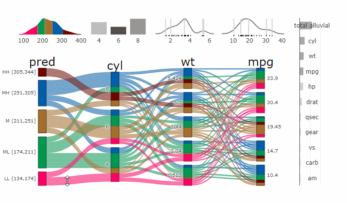

<!-- README.md is generated from README.Rmd. Please edit that file -->

# parcats 

<!-- badges: start -->

[](https://travis-ci.org/erblast/parcats)
[](https://ci.appveyor.com/project/erblast/parcats)
[](https://codecov.io/gh/erblast/parcats?branch=master)
<!-- badges: end -->

`parcats` adds interactive graphing capabilities to the ‘easyalluvial’
package. The ‘plotly.js’ parallel categories diagrams offer a good
framework for creating interactive flow graphs that allow manual drag’n
drop sorting of dimensions and categories, highlightling single flows
and displaying mouse over information. The ‘plotly.js’ dependency is
quite heavy and therefore is outsourced into a seperate package.

## Installation

<!--
### CRAN


```r
install.packages('easyalluvial')
```
-->

### Development Version

``` r

# install.packages("devtools")
devtools::install_github("erblast/parcats")
```

## easyalluvial

`parcats` requires an alluvial plot created with `easyalluvial` to
create an interactive parrallel categories diagram.

  - [Data exploration with alluvial
    plots](https://www.datisticsblog.com/2018/10/intro_easyalluvial/#features)

  - [easyalluvial github page](https://github.com/erblast/easyalluvial)

## Examples

``` r
suppressPackageStartupMessages( require(tidyverse) )
suppressPackageStartupMessages( require(easyalluvial) )
suppressPackageStartupMessages( require(parcats) )
```

### Parcats from alluvial from data in wide format

``` r
p = alluvial_wide(mtcars2, max_variables = 5)

parcats(p, marginal_histograms = TRUE, data_input = mtcars2)
```


### Parcats from model response alluvial

Machine Learning models operate in a multidimensional space and their
response is hard to visualise. Model response and partial dependency
plots attempt to visualise ML models in a two dimensional space. Using
alluvial plots or parrallel categories diagrams we can increase the
number of dimensions.

  - [Visualise model response with alluvial
    plots](https://www.datisticsblog.com/page/visualising-model-response-with-easyalluvial/)

Here we see the response of a random forest model if we vary the three
variables with the highest importance while keeping all other features
at their median/mode value.

``` r
df = select(mtcars2, -ids )
m = randomForest::randomForest( disp ~ ., df)
imp = m$importance
dspace = get_data_space(df, imp, degree = 3)
pred = predict(m, newdata = dspace)
p = alluvial_model_response(pred, dspace, imp, degree = 3)

parcats(p, marginal_histograms = TRUE, imp = TRUE, data_input = df)
```


